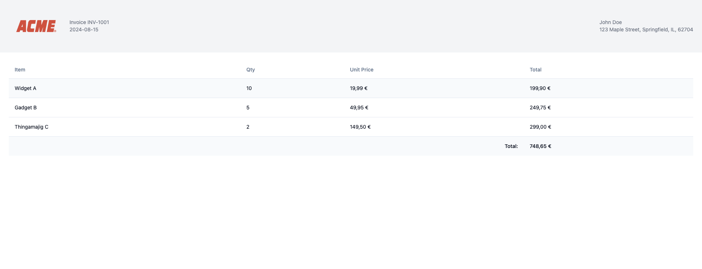

# Printerz Invoice template example

Built with :
- React 
- TailwindCSS
- Vite
- TypeScript
- shadcn UI
- v0.dev

## Preview


## How to use

### Want to use it as it is ?

Go download the template from the release page and upload it to your printerz dashboard.

### Want to modify it ?

1. Clone the repository and run the following commands :

```bash
npx degit https://github.com/printerz-app/printerz-example-templates/react-invoice-template
```

2. Install dependencies

```bash
pnpm install
## or
npm install
## or 
yarn install
```

3. Run the development server

```bash
pnpm dev
## or
npm run dev
## or 
yarn dev
```

4. Make your changes

You can test the print variable behavior by copy pasting the following code in the console of your browser :
```js
window.printerzRender({
  "invoiceNumber": "INV-1001",
  "invoiceDate": "2024-08-15",
  "customer": {
    "name": "John Doe",
    "address": "123 Maple Street, Springfield, IL, 62704"
  },
  "invoiceItems": [
    {
      "name": "Widget A",
      "quantity": 10,
      "unitPrice": 1999
    },
    {
      "name": "Gadget B",
      "quantity": 5,
      "unitPrice": 4995
    },
    {
      "name": "Thingamajig C",
      "quantity": 2,
      "unitPrice": 14950
    }
  ]
})
```

5. Build the project

```bash
pnpm build
## or
npm run build
## or 
yarn build
```

6. Zip the dist folder and upload it to your printerz dashboard